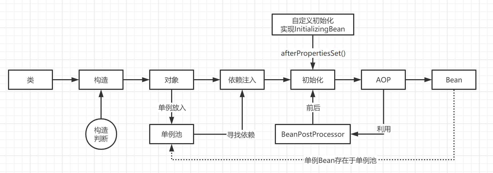

# 手写Spring

## （一）Bean的生命周期



### 构造判断

* s1：对象内没有构造方法

    a1：会调用无参构造（默认构造）

* s2：对象内存在无参构造和有参构造两种构造方法

    a2：会调用无参构造
  
* s3：对象内只存在有参构造

    a3：会调用有参构造
  
* s4：对象内存在两个有参构造，不存在无参构造

    a4：会报错，因为不知道用哪个
  
* s5：对象内存在两个有参构造，但其中一个添加了`@Autowire`

    a5：会调用添加了`@Autowire`的
  
### 有参构造

我的有参构造，如果是需要bean注入进去的情况下，我怎么办呢？

ByType和ByName的方式来注入。

先进行ByType在进行ByName。

* s1：我们创建了三个Bean为service、service1、service2，这个时候我们`@Autowire Service service`结果是什么呢？

    a1：结果是注入了service（先通过ByType找到三个，再通过ByName找到service）
  
* s2：创建三个Bean为service1、service2、service3，这个时候进行装配，结果是装配那个呢？

    a2：结果是报错，因为ByType找到三个，ByName却没有匹配的，所以报错结束。
  
* s3：创建两个Bean为service和service1，我们在service的@Bean注解添加autowireCandidate = false属性，结果会怎样

    a3：结果是注入了service1，也就是注解没添加属性的那一个
  
* s4：仍然是上面的情况，我多添加一个service2的bean，结果？

    a4：报错，与第二个问题一样，找不到匹配的bean

* s5：添加Qualifier注解的情况？

    a5：会自动注入添加相同分组的Bean，多个的时候也会报错

* s6：添加Primary注解

    a6：添加这个注解就是为这些Bean标记**主Bean**会找他。当然也可以添加优先级。
  
### @Resource

刚刚的依赖注入全是基于Autowire的，现在来看看@Resource的情况。

其实@Resource就是ByName再ByType，但是可以传入beanName作为参数，如果这个Name的Bean没找到直接报错。

## （二）事务

### 简单例子

事务是通过AOP实现的，AOP是通过创建一个代理对象实现的，例如

```java
class UserServiceProxy extends UserService {
  private UserService target;
  public void test() {
    // 建立数据库连接
    // 初始化的设置
    // conn.isAutoCommit = false
    try {
      target.test();  // 执行本身的业务sql
    } catch (Exception e) {
      // 回滚
      // conn.rollback()
    }
    // 成功 提交
    // conn.commit()
  }
}
```

### 代理被代理的区别

看代码

```java
class UserService {
  @Transactional
  public void test() {
    jdbcTemplate.execute("sql...");
    a();
  }
  
  @Transcational(propagation = Propagation.NEVER)
  public void a() {
    
  }
}
```

问题：调用的a()方法是被代理对象的还是代理对象的？

答案：被代理对象的。因为我们调用a()是在test()方法内调用**本身**的a()方法。

那么我们怎么改呢？如下

```java
class UserService {

  @Autowire
  private UserService userService;

  @Transactional

  public void test() {
    jdbcTemplate.execute("sql...");
    userService.a();
  }

  @Transcational(propagation = Propagation.NEVER)
  public void a() {

  }
}
```

运行报错，因为传播机制的问题，说明事务传播生效。

### 新开事务

那么传播机制是新开一个事务是什么情况呢？

```java
class UserService {

  @Autowire
  private UserService userService;

  @Transactional

  public void test() {
    jdbcTemplate.execute("sql...");
    userService.a();
  }

  @Transcational(propagation = Propagation.REQUIRES_NEW)
  public void a() {
    jdbcTemplate.execute("sql2...");
    throw new NullPointerException();
  }
}
```

猜测的情况应该是`sql`执行了，`sql2`没执行。

检查数据库发现，其实`sql`和`sql2`都没执行，这就是Spring事务坑的地方。我们看上去像是两个事物，但实际上我们看到一开始的代码，其实这个抛异常把`sql`的逻辑也抛了。

现在是情况2，我们看一下代码

```java
class UserService {

  @Autowire
  private UserService userService;

  @Transactional

  public void test() {
    jdbcTemplate.execute("sql...");
    userService.a();
    throw new NullPointerException();
  }

  @Transcational(propagation = Propagation.REQUIRES_NEW)
  public void a() {
    jdbcTemplate.execute("sql2...");
  }
}
```

这个时候就是`sql`回滚，`sql2`还留着，具体原因参考事务的那个详细代码一看就懂，主要是看异常的抛出机制。